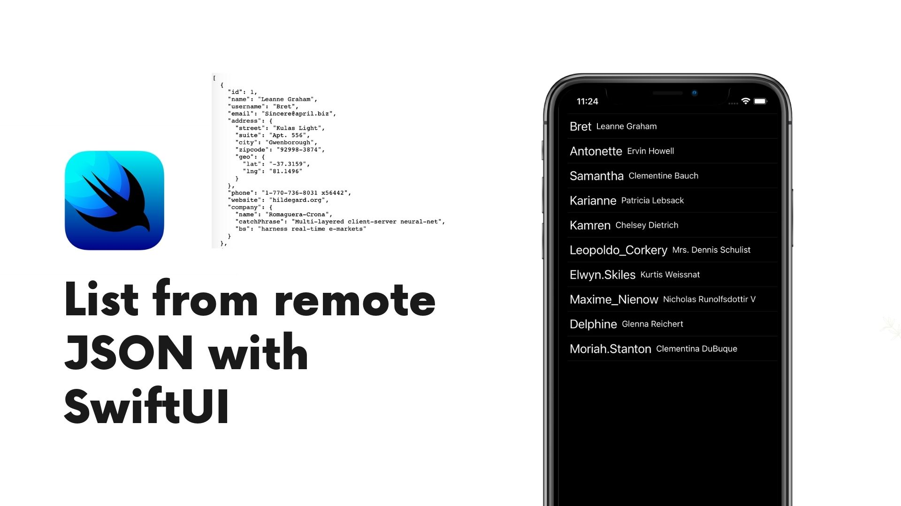

An example on how to make an API call from a remote JSON file and display it in a SwiftUI list. Using Xcode 12 and SwiftUI 2.0.

It's using the JSON placeholder available at the following link: 
https://jsonplaceholder.typicode.com/users

Here how it look's like:

